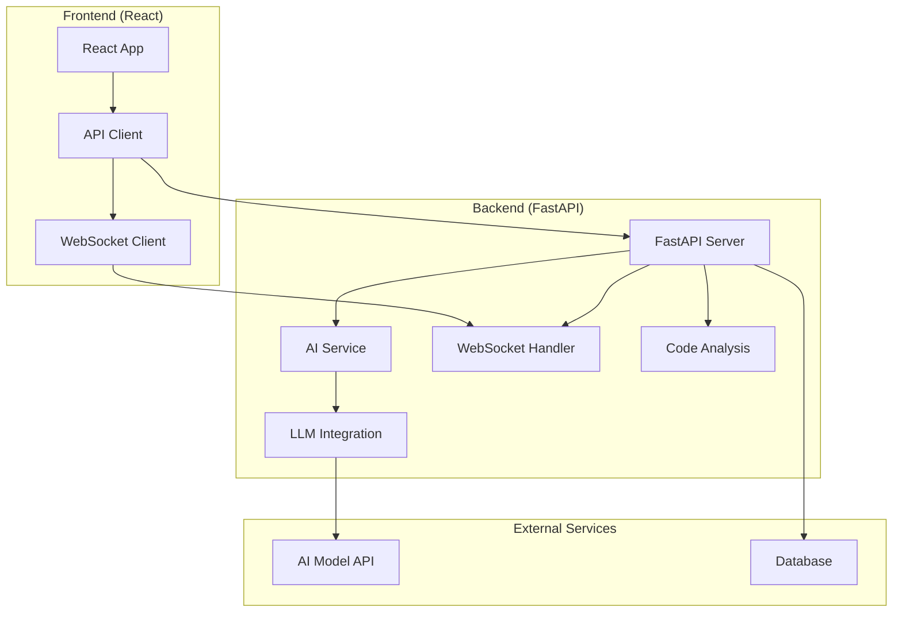
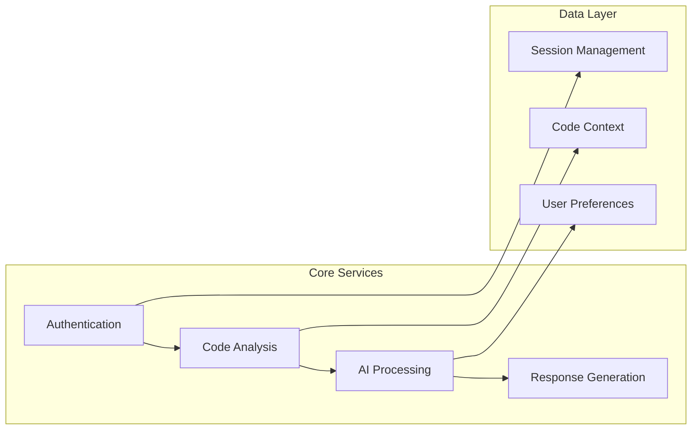

# Augment Code Assistant

A sophisticated AI-powered code assistant built with FastAPI and React, featuring real-time code analysis, intelligent suggestions, and seamless IDE integration.

## Overview

This project consists of a FastAPI backend that provides AI-powered code assistance capabilities and a React frontend for user interaction. The system supports real-time code analysis, intelligent completions, and contextual suggestions.

## Architecture



## System Components



## Features

- **Real-time Code Analysis**: Instant feedback and suggestions as you type
- **Intelligent Completions**: Context-aware code completions powered by AI
- **Multi-language Support**: Support for various programming languages
- **WebSocket Integration**: Real-time communication between frontend and backend
- **Extensible Architecture**: Modular design for easy feature additions

## Quick Start

### Prerequisites

- Python 3.8+
- Node.js 16+
- npm or yarn

### Backend Setup

1. Install dependencies:
```bash
pip install -r requirements.txt
```

2. Set environment variables (see Environment Variables section)

3. Run the server:
```bash
uvicorn main:app --reload
```

### Frontend Setup

1. Install dependencies:
```bash
npm install
```

2. Start development server:
```bash
npm start
```

## Environment Variables

The following environment variables are required:

### Core Configuration
- `API_KEY`: API key for AI model access
- `MODEL_NAME`: Name of the AI model to use (default: "claude-3-sonnet")
- `BASE_URL`: Base URL for the AI service
- `DEBUG`: Enable debug mode (true/false)

### Server Configuration
- `HOST`: Server host (default: "0.0.0.0")
- `PORT`: Server port (default: 8000)
- `CORS_ORIGINS`: Allowed CORS origins (comma-separated)

### Database Configuration
- `DATABASE_URL`: Database connection string
- `DB_HOST`: Database host
- `DB_PORT`: Database port
- `DB_NAME`: Database name
- `DB_USER`: Database username
- `DB_PASSWORD`: Database password

### Security
- `SECRET_KEY`: Secret key for session management
- `JWT_SECRET`: JWT token secret
- `ENCRYPTION_KEY`: Key for data encryption

### Optional Configuration
- `LOG_LEVEL`: Logging level (DEBUG, INFO, WARNING, ERROR)
- `MAX_TOKENS`: Maximum tokens per request
- `TIMEOUT`: Request timeout in seconds
- `RATE_LIMIT`: Rate limiting configuration

## API Documentation

### Core Endpoints

```mermaid
graph TD
    A[/api/v1] --> B[/chat]
    A --> C[/analyze]
    A --> D[/complete]
    A --> E[/health]
    
    B --> F[POST: Send message]
    C --> G[POST: Analyze code]
    D --> H[POST: Get completions]
    E --> I[GET: Health check]
```

### WebSocket Endpoints

- `/ws/chat`: Real-time chat communication
- `/ws/analysis`: Live code analysis updates

## Development

### Project Structure

```
├── backend/
│   ├── app/
│   │   ├── api/          # API routes
│   │   ├── core/         # Core functionality
│   │   ├── models/       # Data models
│   │   └── services/     # Business logic
│   ├── tests/            # Test files
│   └── requirements.txt
├── frontend/
│   ├── src/
│   │   ├── components/   # React components
│   │   ├── services/     # API services
│   │   └── utils/        # Utilities
│   ├── public/
│   └── package.json
└── docs/                 # Documentation
```

### Testing

Run backend tests:
```bash
pytest
```

Run frontend tests:
```bash
npm test
```

### Contributing

1. Fork the repository
2. Create a feature branch
3. Make your changes
4. Add tests
5. Submit a pull request

## Deployment

### Docker Deployment

```bash
docker-compose up -d
```

### Manual Deployment

1. Build frontend:
```bash
npm run build
```

2. Deploy backend with production WSGI server:
```bash
gunicorn main:app -w 4 -k uvicorn.workers.UvicornWorker
```

## Monitoring and Logging

The application includes comprehensive logging and monitoring capabilities:

- Health check endpoints
- Performance metrics
- Error tracking
- Request/response logging

## Security Considerations

- API key management
- CORS configuration
- Rate limiting
- Input validation
- Secure WebSocket connections

## License

[Add your license information here]

## Support

For support and questions, please [add contact information or issue tracker link].