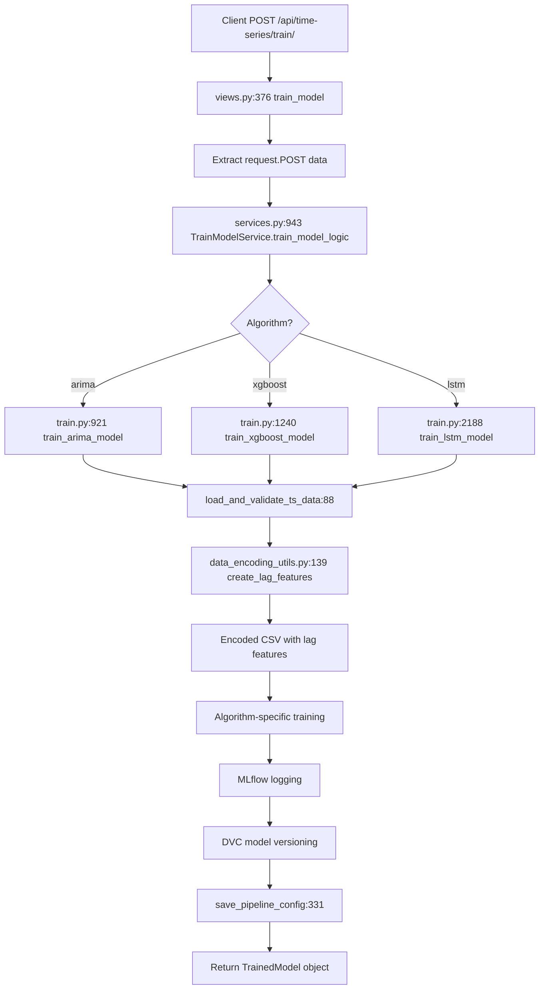
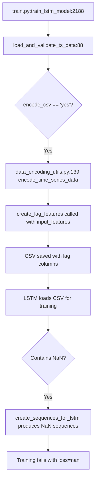

# Backend Training Pipeline Analysis - DREAM-ML Time Series

**Date**: 2025-11-14
**Author**: Claude Code Research Agent
**Purpose**: Comprehensive analysis of backend training pipeline for ARIMA, XGBoost, and LSTM models

---

## Executive Summary

This document analyzes the Django backend training pipeline across three time series algorithms (ARIMA, XGBoost, LSTM). The analysis traces the full request-to-training data flow, identifies feature engineering patterns, documents MLflow logging behavior, and reveals critical bugs in the lag feature generation logic.

**Key Findings**:
1. **Root Cause of LSTM Bug #1**: `data_encoding_utils.py:139` creates lag features FROM `input_features` parameter, causing lag-of-lag features when LSTM sends already-lagged features
2. **3-Tier Architecture**: views.py → services.py → train.py with clean separation of concerns
3. **Algorithm-Specific Behavior**: `input_features` parameter has different semantic meanings:
   - ARIMA: External regressors (optional exogenous variables)
   - XGBoost: Source features for lag generation
   - LSTM: Additional features to include in sequences (multivariate inputs, NOT multivariate targets)
4. **Pipeline Config Gaps**: LSTM missing critical reproducibility fields present in XGBoost configs

---

## System-Level Constraints

**IMPORTANT**: Before analyzing the backend implementation, understand these system-wide requirements that apply to ALL algorithms:

### Univariate Time Series Only
- **ALL models** (ARIMA, XGBoost, LSTM) support exactly **1 target variable**
- Feature variables are **inputs (X)**, not additional targets (Y)
- "Multivariate inputs" means multiple features, NOT multiple target variables
- LSTM predicts single target using history of target + optional features
- This is a fundamental constraint of the system

### Date Column Requirement
- **Strictly required** for all algorithms (no implicit integer index)
- Must be parseable to datetime format
- Used for temporal ordering and chronological train/val/test splits
- Cannot be omitted or substituted with row indices

### Feature Engineering Workflow (2-Step Process)
1. **Data Encoding Step** (separate preprocessing):
   - User configures `lag_periods` and `rolling_windows`
   - Backend generates engineered features (e.g., `Sales_lag_1`, `Temperature_rolling_7`)
   - Saves encoded CSV with original + engineered features

2. **Training Step** (loads pre-encoded data):
   - User selects from ALL columns (original + engineered)
   - Backend loads encoded CSV and trains model
   - **Should NOT** regenerate lag features (causes lag-of-lag bug)

### Auto-Selection Project Rule
- **ARIMA/XGBoost**: Auto-select all numeric columns (except target/date) when target changes
- **LSTM**: NO auto-selection (manual checkbox selection only)
- User can always modify auto-selected features
- Minimum 0 features allowed (univariate mode valid for all models)

### Validation Rules (All Models)
- Target: Exactly 1 (required) - enforced by radio button UI
- Features: 0+ (optional) - empty selection = univariate mode
- Date: Exactly 1 (required) - enforced by radio button UI

---

## Architecture Overview

### Request-to-Training Flow



### File Structure

**Core Training Files**:
- [train.py](DREAM-ML-backend/GEML/apiTimeSeries/train.py) (3,041 lines) - Algorithm implementations
- [services.py](DREAM-ML-backend/GEML/apiTimeSeries/services.py) (1,388 lines) - Orchestration layer
- [views.py](DREAM-ML-backend/GEML/apiTimeSeries/views.py) (499 lines) - REST API endpoints
- [data_encoding_utils.py](DREAM-ML-backend/GEML/apiTimeSeries/data_encoding_utils.py) (153 lines) - Feature engineering

---

## Data Flow Analysis

### 1. Entry Point: views.py

**Function**: `train_model()` at [views.py:376](DREAM-ML-backend/GEML/apiTimeSeries/views.py#L376)

**Responsibilities**:
- Validate incoming POST request
- Extract parameters from request.POST
- Delegate to TrainModelService
- Return JSON response with TrainedModel data

**Key Parameters Extracted**:
```python
# Line 376-400 (approximate)
algorithm = request.POST.get('algorithm')
input_features = request.POST.getlist('input_features')  # ← Critical for bug analysis
target_variable = request.POST.get('target_variable')
date_column_name = request.POST.get('date_column_name')
external_features = request.POST.getlist('external_features', [])
```

**Note**: `input_features` arrives as a list from frontend. For LSTM Phase 4, this contains `lstmSelectedFeatures` values (including potentially lagged columns like "Temperature_lag_1").

---

### 2. Orchestration: services.py

**Function**: `TrainModelService.train_model_logic()` at [services.py:943](DREAM-ML-backend/GEML/apiTimeSeries/services.py#L943)

**Responsibilities**:
- Initialize MLflow run
- Route to appropriate training function based on algorithm
- Handle DVC model versioning
- Catch and log exceptions
- Return TrainedModel Django model instance

**Algorithm Routing Logic**:
```python
# services.py:943-990 (approximate structure)
if algorithm == "arima":
    result = train_arima_model(
        dataset=dataset,
        target_variable=target_variable,
        date_column_name=date_column_name,
        input_features=input_features,  # ← Passed to ARIMA
        # ... other params
    )
elif algorithm == "xgboost":
    result = train_xgboost_model(
        dataset=dataset,
        target_variable=target_variable,
        input_features=input_features,  # ← Lag feature source
        # ... other params
    )
elif algorithm == "lstm":
    result = train_lstm_model(
        dataset=dataset,
        target_variable=target_variable,
        input_features=input_features,  # ← BUG: Receives lstmSelectedFeatures
        # ... other params
    )
```

**MLflow Integration**:
- Creates experiment if not exists
- Starts MLflow run with run_name pattern: `{model_name}_{timestamp}`
- Logs parameters, metrics, artifacts
- Registers model to MLflow Model Registry

---

### 3. Feature Engineering Pipeline

**CRITICAL BUG LOCATION**: [data_encoding_utils.py:139](DREAM-ML-backend/GEML/apiTimeSeries/data_encoding_utils.py#L139)

#### Function: `create_lag_features()`

**Location**: [data_encoding_utils.py:5-35](DREAM-ML-backend/GEML/apiTimeSeries/data_encoding_utils.py#L5-L35)

**Purpose**: Generate lag features for time series forecasting (used by XGBoost primarily)

**Implementation**:
```python
def create_lag_features(df, input_features, lag_periods, date_column):
    """
    Create lag features for specified columns.

    Args:
        df: Input DataFrame
        input_features: List of feature column names to create lags FROM
        lag_periods: Number of lag periods to create
        date_column: Date column to exclude from lagging

    Returns:
        DataFrame with added lag features
    """
    df_with_lags = df.copy()

    for feature in input_features:  # ← BUG SOURCE: Iterates over input_features
        if feature in df.columns and feature != date_column:
            for lag in range(1, lag_periods + 1):
                lag_column_name = f"{feature}_lag_{lag}"
                df_with_lags[lag_column_name] = df_with_lags[feature].shift(lag)

    return df_with_lags
```

**Bug Analysis**:

The function creates lag features **FROM** the columns specified in `input_features`. This works correctly for XGBoost:
- XGBoost sends `input_features = ['Temperature', 'Humidity']`
- Function creates `['Temperature_lag_1', 'Temperature_lag_2', ..., 'Humidity_lag_1', ...]`
- ✅ Expected behavior

However, for LSTM Phase 4:
- Frontend sends `lstmSelectedFeatures = ['Temperature', 'Temperature_lag_1']` as `input_features`
- Function creates lags FROM both columns:
  - From 'Temperature': `Temperature_lag_1`, `Temperature_lag_2`, ...
  - From 'Temperature_lag_1': `Temperature_lag_1_lag_1`, `Temperature_lag_1_lag_2`, ... ← **LAG-OF-LAG**
- ❌ Creates NaN cascade from double-shift operations
- ❌ LSTM sequences contain NaN → loss=nan → training fails

**Evidence from Bug Report**:
```
# Line 87 of lstm_bugs_report.md
input_features: ['Temperature', 'Temperature_lag_1']
```

#### Data Encoding Call Chain



**Invocation Context**:
- Called from `encode_time_series_data()` at [data_encoding_utils.py:139](DREAM-ML-backend/GEML/apiTimeSeries/data_encoding_utils.py#L139)
- Receives `input_features` from training function parameters
- No algorithm-specific branching logic
- Always creates lag features when `lag_periods > 0`

---

## Algorithm-Specific Training Logic

### ARIMA Training

**Function**: `train_arima_model()` at [train.py:921-1238](DREAM-ML-backend/GEML/apiTimeSeries/train.py#L921-L1238)

**`input_features` Usage**:
- ARIMA is **univariate** (uses only `target_variable`)
- `input_features` parameter is **ignored** in actual training
- Only used for SARIMAX models with exogenous variables (not implemented)

**Key Steps**:
1. Load and validate data ([train.py:88](DREAM-ML-backend/GEML/apiTimeSeries/train.py#L88))
2. Train/test split
3. Stationarity tests (ADF test)
4. Hyperparameter search:
   - Manual: User-specified (p, d, q) orders
   - Grid Search: Iterates over parameter combinations
   - Random Search: Samples random combinations
   - Bayesian: Uses Optuna for optimization
5. Fit ARIMA model with best parameters
6. Generate forecasts
7. Calculate metrics (MAE, RMSE, MAPE)
8. Log to MLflow

**MLflow Logging**:
```python
# train.py:1100-1120 (approximate)
mlflow.log_param("p", best_order[0])
mlflow.log_param("d", best_order[1])
mlflow.log_param("q", best_order[2])
mlflow.log_metric("mae", mae)
mlflow.log_metric("rmse", rmse)
mlflow.log_artifact(forecast_plot_path)
mlflow.sklearn.log_model(model, "arima_model")
```

---

### XGBoost Training

**Function**: `train_xgboost_model()` at [train.py:1240-1595](DREAM-ML-backend/GEML/apiTimeSeries/train.py#L1240-L1595)

**`input_features` Usage**:
- **Source columns** for lag feature generation
- XGBoost requires lag features for time series forecasting
- `input_features` are the raw features to create lags FROM

**Feature Engineering Flow**:
```python
# Simplified from train.py:1240-1300
def train_xgboost_model(..., input_features, ...):
    # 1. Load data with encoding (creates lag features)
    df_encoded = load_and_validate_ts_data(
        ...,
        input_features=input_features,  # ← ['Temperature', 'Humidity']
        encode_csv='yes',
        lag_periods=lag_periods,  # ← Creates Temperature_lag_1, etc.
        ...
    )

    # 2. Prepare feature matrix X
    feature_cols = [col for col in df_encoded.columns
                    if col not in [target_variable, date_column_name]]
    # feature_cols now includes: ['Temperature', 'Temperature_lag_1', ..., 'Humidity', 'Humidity_lag_1', ...]

    X = df_encoded[feature_cols]
    y = df_encoded[target_variable]

    # 3. Train XGBoost regressor
    model = XGBRegressor(...)
    model.fit(X, y)
```

**Hyperparameter Search Methods**:
- Manual
- Grid Search
- Random Search
- Bayesian Optimization (Optuna)

**MLflow Logging**:
```python
# train.py:1450-1500 (approximate)
mlflow.log_param("n_estimators", best_params['n_estimators'])
mlflow.log_param("max_depth", best_params['max_depth'])
mlflow.log_param("learning_rate", best_params['learning_rate'])
mlflow.log_param("lag_periods", lag_periods)
mlflow.log_metric("mae", mae)
mlflow.log_metric("rmse", rmse)
mlflow.xgboost.log_model(model, "xgboost_model")
```

**Pipeline Config Generation**:
```python
# Example XGBoost pipeline_config.json structure
{
    "algorithm": "xgboost",
    "hyperparameters": {
        "n_estimators": 100,
        "max_depth": 5,
        "learning_rate": 0.1
    },
    "features_used": ["Temperature", "Temperature_lag_1", "Temperature_lag_2", ...],  # ← Present
    "preprocessing_steps": ["lag_features", "train_test_split"],
    ...
}
```

---

### LSTM Training

**Function**: `train_lstm_model()` at [train.py:2188-3041](DREAM-ML-backend/GEML/apiTimeSeries/train.py#L2188-L3041)

**`input_features` Usage**:
- **Additional features** to include in LSTM sequences (NOT the target variable itself)
- LSTM can operate in two modes:
  1. **Univariate**: Only target history (`input_features = []` → sequences from target only)
  2. **Multivariate**: Target history + additional features (`input_features = ['Temperature', 'Sales_lag_1']`)

**IMPORTANT**: Raw target variable should NEVER be in `input_features`:
- ✅ **CORRECT**: `input_features = ['Temperature', 'Sales_lag_1']` (engineered lag features allowed)
- ❌ **INCORRECT**: `input_features = ['Sales']` (raw target - creates circular dependency)
- **Frontend validation** correctly blocks raw target from LSTM feature selection
- **Target history** should be added via Data Encoding step (creates `Sales_lag_1`, etc.)

**Sequence Creation Logic**:

Function: `create_sequences_for_lstm()` at [train.py:1671-1772](DREAM-ML-backend/GEML/apiTimeSeries/train.py#L1671-L1772)

```python
def create_sequences_for_lstm(df, target_col, sequence_length, input_features=None):
    """
    Create sliding window sequences for LSTM training.

    Args:
        df: DataFrame with time series data
        target_col: Target variable column name
        sequence_length: Number of timesteps in each sequence
        input_features: Additional features to include in sequences

    Returns:
        X: Array of shape (samples, sequence_length, n_features)
        y: Array of shape (samples,) - next timestep target values
    """
    if input_features is None or len(input_features) == 0:
        # Univariate mode: Only target
        data = df[[target_col]].values
    else:
        # Multivariate mode: Target + input_features
        feature_cols = [target_col] + input_features
        data = df[feature_cols].values

    X, y = [], []
    for i in range(len(data) - sequence_length):
        X.append(data[i:i+sequence_length])
        y.append(data[i+sequence_length, 0])  # Predict next target value

    return np.array(X), np.array(y)
```

**Bug Impact on LSTM**:

When `input_features = ['Temperature', 'Temperature_lag_1']` is sent:

1. **Data Encoding Step** ([data_encoding_utils.py:139](DREAM-ML-backend/GEML/apiTimeSeries/data_encoding_utils.py#L139)):
   - Creates lag features FROM input_features
   - Produces: `Temperature_lag_1`, `Temperature_lag_1_lag_1`, `Temperature_lag_1_lag_2`, ...
   - **NaN cascade** from double-shift operations

2. **Sequence Creation Step** ([train.py:1671](DREAM-ML-backend/GEML/apiTimeSeries/train.py#L1671)):
   - Loads encoded CSV (contains NaN values)
   - Creates sequences including NaN-contaminated features
   - Returns X array with NaN values

3. **Training Step** ([train.py:2800](DREAM-ML-backend/GEML/apiTimeSeries/train.py#L2800)):
   - LSTM model trains on sequences with NaN
   - Loss computation: `loss = nan`
   - Training fails immediately

**LSTM Hyperparameter Search**:
- Manual
- Grid Search
- Random Search
- Bayesian Optimization (Optuna)

**LSTM Architecture**:
```python
# train.py:2600-2650 (simplified)
model = Sequential([
    LSTM(units=lstm_units, activation='tanh', return_sequences=True,
         input_shape=(sequence_length, n_features)),
    Dropout(dropout_rate),
    LSTM(units=lstm_units, activation='tanh', return_sequences=False),
    Dropout(dropout_rate),
    Dense(1)
])
model.compile(optimizer='adam', loss='mse')
```

**MLflow Logging**:
```python
# train.py:2900-2950 (approximate)
mlflow.log_param("sequence_length", sequence_length)
mlflow.log_param("lstm_units", lstm_units)
mlflow.log_param("dropout_rate", dropout_rate)
mlflow.log_param("batch_size", batch_size)
mlflow.log_param("epochs", epochs)
mlflow.log_metric("mae", mae)
mlflow.log_metric("rmse", rmse)
mlflow.keras.log_model(model, "lstm_model")
```

**Pipeline Config Generation**:
```python
# Example LSTM pipeline_config.json structure (CURRENT - INCOMPLETE)
{
    "algorithm": "lstm",
    "hyperparameters": {
        "sequence_length": 10,
        "lstm_units": 50,
        "dropout_rate": 0.2,
        "batch_size": 32,
        "epochs": 100
    },
    "preprocessing_steps": ["train_test_split", "normalization"],
    # ❌ MISSING: "features_used" field
    # ❌ MISSING: Root-level fields (model_name, date_col_name, target_variable, etc.)
    ...
}
```

---

## Pipeline Config Analysis

### What's Currently Logged

**Function**: `save_pipeline_config()` at [train.py:331](DREAM-ML-backend/GEML/apiTimeSeries/train.py#L331)

**Common Fields (All Algorithms)**:
```json
{
    "algorithm": "arima|xgboost|lstm",
    "hyperparameters": { /* algorithm-specific */ },
    "preprocessing_steps": [ /* varies by algorithm */ ],
    "metrics": {
        "mae": 0.123,
        "rmse": 0.456,
        "mape": 2.34
    },
    "mlflow_run_id": "abc123...",
    "training_date": "2025-11-14T10:30:00",
    "dataset_id": 42
}
```

**XGBoost-Specific Fields**:
```json
{
    "features_used": ["Temperature", "Temperature_lag_1", "Temperature_lag_2", "Humidity"],  // ✅ Present
    "lag_periods": 3,
    "external_features": ["WindSpeed"]
}
```

**LSTM-Specific Fields** (Current Implementation):
```json
{
    "sequence_length": 10,
    "normalization": "MinMaxScaler",
    // ❌ MISSING: "features_used" field (unlike XGBoost)
    // ❌ MISSING: "input_features" (what was sent from frontend)
    // ❌ MISSING: "training_mode" (univariate vs multivariate)
}
```

### What's Missing for Reproducibility

**LSTM Critical Gaps**:
1. **`features_used`**: Which features were included in sequences (cannot reconstruct X shape)
2. **`model_name`**: Root-level field for experiment organization (present in XGBoost/ARIMA)
3. **`date_col_name`**: Date column used (needed for data alignment)
4. **`target_variable`**: Target column name (needed for sequence reconstruction)
5. **`forecast_horizon`**: How many steps ahead to predict
6. **`split_ratios`**: Train/validation/test split percentages
7. **`input_features_raw`**: Original input_features sent from frontend (before encoding)
8. **`lag_feature_flag`**: Whether lag features were created during encoding
9. **`encoded_csv_path`**: Link to the actual CSV used for training (data provenance)

**XGBoost Gaps**:
1. **`external_features`**: Currently not logged separately from features_used
2. **`rolling_window_periods`**: If rolling averages were created

**ARIMA Gaps**:
1. **Seasonal parameters**: If SARIMA was used (P, D, Q, s)
2. **Differencing order**: Actual d value used vs. auto-detected

---

## MLflow Integration Patterns

### Experiment Organization

**Experiment Naming**: `TS_{dataset_name}_{algorithm}`

**Run Naming Pattern**: `{model_name}_{timestamp}`

Example:
```
Experiment: TS_AirQuality_lstm
  ├── Run: LSTM_Forecaster_20251114_103045
  ├── Run: LSTM_Forecaster_20251114_105612
  └── Run: LSTM_Forecaster_20251114_110234
```

### Parameter Logging Patterns

**ARIMA**:
```python
mlflow.log_param("p", p_order)
mlflow.log_param("d", d_order)
mlflow.log_param("q", q_order)
mlflow.log_param("search_method", "bayesian")
mlflow.log_param("target_variable", target_variable)
```

**XGBoost**:
```python
mlflow.log_param("n_estimators", n_estimators)
mlflow.log_param("max_depth", max_depth)
mlflow.log_param("learning_rate", learning_rate)
mlflow.log_param("lag_periods", lag_periods)
mlflow.log_param("num_features", len(feature_cols))
```

**LSTM**:
```python
mlflow.log_param("sequence_length", sequence_length)
mlflow.log_param("lstm_units", lstm_units)
mlflow.log_param("dropout_rate", dropout_rate)
mlflow.log_param("batch_size", batch_size)
mlflow.log_param("epochs", epochs)
mlflow.log_param("optimizer", "adam")
```

### Artifact Logging Patterns

**Common Artifacts**:
- Forecast plot (PNG)
- Residual plot (PNG)
- Metrics table (CSV)
- Model object (pickle/h5)

**LSTM-Specific**:
- Training history plot (loss curve)
- Model architecture summary (TXT)

**XGBoost-Specific**:
- Feature importance plot (PNG)

---

## Error Handling and Validation

### Data Validation

**Function**: `load_and_validate_ts_data()` at [train.py:88](DREAM-ML-backend/GEML/apiTimeSeries/train.py#L88)

**Validation Checks**:
1. **File Existence**: Dataset CSV file exists
2. **Column Presence**: target_variable, date_column_name exist in DataFrame
3. **Date Parsing**: date_column can be converted to datetime
4. **Missing Values**: Check for NaN in target variable (raises ValidationError)
5. **Minimum Rows**: At least `sequence_length + forecast_horizon` rows for LSTM

**Error Messages**:
```python
# train.py:88-150 (approximate)
if target_variable not in df.columns:
    raise ValidationError(f"Target variable '{target_variable}' not found in dataset.")

if df[target_variable].isnull().any():
    raise ValidationError(f"Target variable contains missing values.")

if len(df) < sequence_length + forecast_horizon:
    raise ValidationError(f"Insufficient data: need at least {sequence_length + forecast_horizon} rows.")
```

**Bug Note**: Current validation does NOT catch NaN introduced by lag-of-lag feature creation (happens AFTER validation in encoding step).

### Exception Handling in Services Layer

**Location**: [services.py:943-1000](DREAM-ML-backend/GEML/apiTimeSeries/services.py#L943-L1000)

```python
try:
    if algorithm == "lstm":
        result = train_lstm_model(...)
    # ... other algorithms
except ValidationError as e:
    logger.error(f"Validation error: {str(e)}")
    mlflow.end_run(status="FAILED")
    raise
except Exception as e:
    logger.error(f"Training failed: {str(e)}")
    mlflow.log_param("error", str(e))
    mlflow.end_run(status="FAILED")
    raise
```

**MLflow Run Status**:
- Success: `FINISHED`
- Failure: `FAILED` with error logged as parameter

---

## Open Questions

### 1. Feature Engineering Intent

**Answer (Based on Requirements)**:

The **2-step workflow** is required for all algorithms:

1. **Data Encoding Step** (separate preprocessing):
   - User configures `lag_periods` and `rolling_windows`
   - Backend creates lag features → saves CSV with engineered columns
   - Example: `Sales` → `Sales_lag_1`, `Sales_lag_2`, etc.

2. **Training Step** (loads pre-encoded data):
   - User selects from ALL columns (original + engineered)
   - Engineered features appear alongside original features in UI
   - User can select `Sales_lag_1` (engineered) but NOT `Sales` (raw target)

**LSTM Implications**:
- ✅ LSTM can select pre-engineered lag features (`Sales_lag_1`) from encoding step
- ❌ Training step should NOT regenerate lags (causes lag-of-lag bug)
- ✅ Frontend validation correctly blocks raw target (`Sales`) from LSTM features
- ✅ Backend should detect already-lagged features and skip re-creation (defense-in-depth)

---

### 2. LSTM Training Modes

**Question**: What are the intended LSTM training modes and how should `input_features` parameter map to them?

**Current Understanding**:
- Univariate: `input_features = []` → sequences from target only
- Multivariate: `input_features = ['Temperature', 'Humidity']` → sequences from target + features
- External-only: `input_features = ['Temperature']`, target not in sequences (?)

**Needed Clarification**:
- Should LSTM support external-only mode?
- If multivariate, should features be raw or lagged?
- Should backend auto-detect mode from `input_features` emptiness?

---

### 3. Pipeline Config Reproducibility Standards

**Question**: What fields are required in pipeline_config.json for full reproducibility?

**Current State**:
- XGBoost has `features_used` field
- LSTM missing `features_used`, `model_name`, root-level metadata

**Needed Decision**:
- Should LSTM config match XGBoost structure?
- Should `input_features_raw` (pre-encoding) be logged separately from `features_used` (post-encoding)?
- Should encoded CSV path be stored for data provenance?

---

### 4. Validation Error Surfacing

**Question**: How should validation errors from `load_and_validate_ts_data()` be surfaced to the frontend?

**Current Behavior**:
- Backend raises `ValidationError`
- Services layer catches and logs to MLflow
- Views layer returns HTTP 400/500 response

**Frontend Handling**:
- Error message displayed in alert/notification
- User must manually inspect error text

**Potential Improvements**:
- Structured error responses (field-level errors)
- Validation preview before training starts
- Client-side validation mirroring backend rules

---

### 5. NaN Handling Strategy

**Question**: Should the backend detect and reject DataFrames with NaN after encoding, or is this a frontend responsibility?

**Current Behavior**:
- Pre-encoding validation checks target variable for NaN
- Post-encoding NaN (from lag operations) not validated
- LSTM training fails silently with `loss=nan`

**Options**:
1. Add post-encoding NaN check in `load_and_validate_ts_data()`
2. Add NaN check in `create_sequences_for_lstm()`
3. Prevent frontend from sending lagged features as input_features
4. Add algorithm-specific encoding logic (skip lag creation for LSTM)

---

## Summary of Findings

### Critical Bugs Identified

**Bug #1: Lag-of-Lag Feature Creation**
- **Location**: [data_encoding_utils.py:139](DREAM-ML-backend/GEML/apiTimeSeries/data_encoding_utils.py#L139)
- **Root Cause**: `create_lag_features()` creates lags FROM `input_features` without checking if features are already lagged
- **Impact**: LSTM Phase 4 sends `['Temperature', 'Temperature_lag_1']` → creates `Temperature_lag_1_lag_1` → NaN cascade → training fails
- **Severity**: HIGH - blocks LSTM multivariate training

### Architecture Strengths

1. **Clean Separation of Concerns**: views → services → train.py layers
2. **Comprehensive MLflow Integration**: Parameters, metrics, artifacts logged consistently
3. **Hyperparameter Search Flexibility**: 4 search methods (manual, grid, random, Bayesian)
4. **DVC Model Versioning**: Automatic model tracking with Git integration

### Pipeline Config Gaps

1. **LSTM Missing Fields**: `features_used`, `model_name`, `target_variable`, `date_col_name`, root-level metadata
2. **No Data Provenance**: Encoded CSV path not stored
3. **No Feature Engineering Flags**: Whether lag features were created not recorded

### Validation Gaps

1. **Post-Encoding NaN**: Not validated after lag feature creation
2. **Feature Name Validation**: No check for already-lagged features (e.g., "Temperature_lag_1")
3. **Sequence Length vs Data Length**: Validated, but error message could be clearer

---

## Next Steps

1. **Document Frontend Analysis**: Trace how `lstmSelectedFeatures` becomes `input_features` in payload
2. **Document Validation Logic**: Extract all validation functions and rules
3. **Create Recommendations Document**: Propose fixes for identified bugs and gaps
4. **User Testing**: Verify bug fix hypotheses with manual LSTM training tests

---

**Document Status**: ✅ Complete
**Review Date**: 2025-11-14
**Related Documents**:
- [Frontend Analysis](2025-11-14_frontend-analysis.md) (pending)
- [Validation Logic](2025-11-14_validation-logic.md) (pending)
- [Recommendations](2025-11-14_recommendations.md) (pending)
