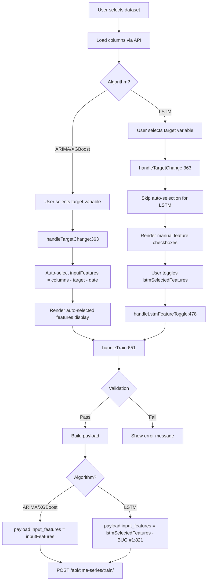

# Frontend Training Form Analysis - DREAM-ML TSTrainCard

**Date**: 2025-11-14
**Author**: Claude Code Research Agent
**Purpose**: Comprehensive analysis of TSTrainCard.jsx component, state management, validation logic, and bug locations

---

## Executive Summary

This document analyzes the TSTrainCard.jsx component (3,212 lines), which provides the training form interface for ARIMA, XGBoost, and LSTM models. The analysis identifies three critical bugs blocking LSTM Phase 4, documents all state variables and their usage patterns, and traces the feature selection data flow.

**Key Findings**:
1. **Bug #1 (Line 821)**: `payload.input_features = lstmSelectedFeatures` override sends LSTM-specific state as generic backend parameter
2. **Bug #2 (Line 681)**: Validation `!inputFeatures.length` blocks LSTM univariate mode (lstmSelectedFeatures is separate state)
3. **Bug #3 (Line 1094)**: Partial fix attempt for button disable doesn't address validation in `handleTrain()`
4. **Dual State System**: `inputFeatures` (ARIMA/XGBoost auto-selected) vs `lstmSelectedFeatures` (LSTM Phase 4 manual)
5. **Algorithm-Conditional Rendering**: 470+ lines of LSTM-specific UI hidden when `algorithm !== "lstm"`

---

## Component Architecture

### File Overview

**Location**: [TSTrainCard.jsx](DREAM-ML-frontend/frontend/src/components/TSTrainCard.jsx)
**Lines**: 3,212
**Type**: React functional component with hooks

**Primary Responsibilities**:
- Render training form with algorithm-specific sections
- Manage feature selection state for three algorithms
- Validate user inputs before submission
- Submit training requests to Django backend
- Display training status and results

---

## State Management Analysis

### Core State Variables

All state declarations are located at [TSTrainCard.jsx:69-312](DREAM-ML-frontend/frontend/src/components/TSTrainCard.jsx#L69-L312)

#### Dataset and Column Selection

```javascript
// Line 69-85
const [dataset, setDataset] = useState(null);                    // Selected Dataset object
const [dateColumnName, setDateColumnName] = useState("");        // Date column
const [targetVariable, setTargetVariable] = useState("");        // Target variable
const [columns, setColumns] = useState([]);                      // Available columns from dataset
```

**Usage Pattern**:
- `dataset`: Selected from dropdown, triggers column loading via API
- `dateColumnName`: Required for all algorithms (time series index)
- `targetVariable`: Required for all algorithms (forecasting target)
- `columns`: Populated after dataset selection, drives feature selection UI

---

#### Feature Selection State (CRITICAL FOR BUG ANALYSIS)

```javascript
// Line 87-95
const [inputFeatures, setInputFeatures] = useState([]);          // ARIMA/XGBoost features (auto-selected)
const [externalFeatures, setExternalFeatures] = useState([]);    // XGBoost/LSTM additional features
const [lstmSelectedFeatures, setLstmSelectedFeatures] = useState([]); // LSTM Phase 4 manual selection
```

**State Semantics**:

| State Variable | Algorithms | Selection Method | Purpose |
|----------------|------------|------------------|---------|
| `inputFeatures` | ARIMA, XGBoost | Auto-selected when target changes | Core features for ARIMA/XGBoost training |
| `externalFeatures` | XGBoost, LSTM | Manual checkboxes | Additional features (external variables) |
| `lstmSelectedFeatures` | LSTM only | Manual checkboxes (Phase 4) | LSTM multivariate features |

**Critical Bug Context**:

The dual-state system creates confusion:
1. ARIMA/XGBoost: User selects target → `inputFeatures` auto-populated with remaining columns
2. LSTM Phase 4: User selects target → `lstmSelectedFeatures` manually selected via checkboxes
3. Validation at line 681 checks `!inputFeatures.length` for ALL algorithms
4. For LSTM, `inputFeatures` remains empty (uses `lstmSelectedFeatures` instead)
5. Validation blocks LSTM submission even when `lstmSelectedFeatures` is intentionally empty (univariate mode)

---

#### Algorithm and Model Configuration

```javascript
// Line 97-115
const [algorithm, setAlgorithm] = useState("arima");             // Selected algorithm: arima|xgboost|lstm
const [modelName, setModelName] = useState("");                  // User-defined model name
const [encodeCsv, setEncodeCsv] = useState("yes");              // Whether to encode CSV (lag features)
const [hyperparameterSearch, setHyperparameterSearch] = useState("manual"); // Search method
```

**Algorithm State**:
- Drives conditional rendering (470+ lines of LSTM-specific UI)
- Affects validation logic (different rules per algorithm)
- Determines which state variables are sent to backend

---

#### Split Ratios and Validation

```javascript
// Line 117-135
const [trainRatio, setTrainRatio] = useState(70);
const [testRatio, setTestRatio] = useState(30);
const [validationRatio, setValidationRatio] = useState(0);       // LSTM only
const [splitRatiosValid, setSplitRatiosValid] = useState(true);
```

**Debounced Validation Pattern**:
- Split ratio changes trigger debounced validation (500ms delay)
- Validates sum equals 100 (or train + test = 100 for ARIMA/XGBoost)
- Sets `splitRatiosValid` state used in button disable logic

---

#### LSTM-Specific State

```javascript
// Line 137-180 (LSTM hyperparameters)
const [sequenceLength, setSequenceLength] = useState(10);
const [lstmUnits, setLstmUnits] = useState(50);
const [dropoutRate, setDropoutRate] = useState(0.2);
const [batchSize, setBatchSize] = useState(32);
const [epochs, setEpochs] = useState(100);
const [lstmLearningRate, setLstmLearningRate] = useState(0.001);

// Line 182-195 (LSTM grid search ranges)
const [sequenceLengthRange, setSequenceLengthRange] = useState([5, 10, 15]);
const [lstmUnitsRange, setLstmUnitsRange] = useState([32, 64, 128]);
const [dropoutRateRange, setDropoutRateRange] = useState([0.1, 0.2, 0.3]);
// ... more range states

// Line 197-210 (LSTM Bayesian search)
const [numTrials, setNumTrials] = useState(20);
const [sequenceLengthMin, setSequenceLengthMin] = useState(5);
const [sequenceLengthMax, setSequenceLengthMax] = useState(20);
// ... more Bayesian range states
```

**Conditional Rendering**:
- These states only appear in UI when `algorithm === "lstm"`
- Grid/Bayesian ranges shown when `hyperparameterSearch !== "manual"`
- 470+ lines of LSTM-specific JSX

---

#### ARIMA-Specific State

```javascript
// Line 212-235
const [pOrder, setPOrder] = useState(1);
const [dOrder, setDOrder] = useState(1);
const [qOrder, setQOrder] = useState(1);

// Grid search ranges
const [pRange, setPRange] = useState([0, 1, 2]);
const [dRange, setDRange] = useState([0, 1, 2]);
const [qRange, setQRange] = useState([0, 1, 2]);

// Bayesian search
const [pMin, setPMin] = useState(0);
const [pMax, setPMax] = useState(5);
// ... more Bayesian ranges
```

---

#### XGBoost-Specific State

```javascript
// Line 237-285
const [nEstimators, setNEstimators] = useState(100);
const [maxDepth, setMaxDepth] = useState(5);
const [learningRate, setLearningRate] = useState(0.1);
const [lagPeriods, setLagPeriods] = useState(3);

// Grid search ranges
const [nEstimatorsRange, setNEstimatorsRange] = useState([50, 100, 200]);
const [maxDepthRange, setMaxDepthRange] = useState([3, 5, 7]);
// ... more ranges

// Bayesian search
const [nEstimatorsMin, setNEstimatorsMin] = useState(50);
const [nEstimatorsMax, setNEstimatorsMax] = useState(300);
// ... more Bayesian ranges
```

---

#### UI State

```javascript
// Line 287-312
const [trainStatus, setTrainStatus] = useState("");              // Status message text
const [trainedModel, setTrainedModel] = useState(null);         // Response from backend
const [isTraining, setIsTraining] = useState(false);            // Loading state
const [forecastHorizon, setForecastHorizon] = useState(12);     // Steps ahead to forecast
```

---

## Feature Selection Data Flow

### Flow Diagram



---

### Target Variable Selection Handler

**Function**: `handleTargetChange()` at [TSTrainCard.jsx:363-382](DREAM-ML-frontend/frontend/src/components/TSTrainCard.jsx#L363-L382)

```javascript
const handleTargetChange = (e) => {
  const selectedTarget = e.target.value;
  setTargetVariable(selectedTarget);

  // Auto-select input features for ARIMA and XGBoost only
  if (algorithm !== "lstm") {
    const remainingColumns = columns.filter(
      (col) => col !== selectedTarget && col !== dateColumnName
    );
    setInputFeatures(remainingColumns);
  } else {
    // LSTM Phase 4: Don't auto-select, user manually chooses lstmSelectedFeatures
    // inputFeatures remains empty for LSTM
  }
};
```

**Logic Analysis**:
- ARIMA/XGBoost: Auto-populate `inputFeatures` with all columns except target and date
- LSTM: Skip auto-selection, leave `inputFeatures` empty
- **Bug Implication**: Line 681 validation expects `inputFeatures.length > 0` for all algorithms, but LSTM intentionally leaves it empty

---

### LSTM Feature Toggle Handler

**Function**: `handleLstmFeatureToggle()` at [TSTrainCard.jsx:478-485](DREAM-ML-frontend/frontend/src/components/TSTrainCard.jsx#L478-L485)

```javascript
const handleLstmFeatureToggle = (feature) => {
  setLstmSelectedFeatures((prev) =>
    prev.includes(feature)
      ? prev.filter((f) => f !== feature)  // Remove if already selected
      : [...prev, feature]                  // Add if not selected
  );
};
```

**UI Integration**:
- Rendered in LSTM-specific section (line 1200-1250 approximate)
- Checkboxes for each column (excluding target and date)
- User can select 0 features (univariate mode) or multiple (multivariate mode)

---

### Validation Function

**Function**: `validateSelections()` at [TSTrainCard.jsx:392-422](DREAM-ML-frontend/frontend/src/components/TSTrainCard.jsx#L392-L422)

```javascript
const validateSelections = () => {
  // Check for overlap between input features and external features
  if (algorithm === "xgboost") {
    const overlap = inputFeatures.filter((feat) =>
      externalFeatures.includes(feat)
    );
    if (overlap.length > 0) {
      setTrainStatus(
        `⚠️ Las siguientes variables están en ambos: ${overlap.join(", ")}`
      );
      return false;
    }
  }

  // Check for target in features (LSTM-specific)
  if (algorithm === "lstm") {
    if (lstmSelectedFeatures.includes(targetVariable)) {
      setTrainStatus("⚠️ La variable target no puede estar en las características seleccionadas.");
      return false;
    }
  }

  return true;
};
```

**Validation Rules**:
1. XGBoost: No overlap between `inputFeatures` and `externalFeatures`
2. LSTM: Target variable cannot be in `lstmSelectedFeatures`

**Called From**:
- `handleTrain()` before submission (line 680)
- Debounced on feature selection changes (line 440)

---

## Bug Locations and Analysis

### Bug #1: Incorrect Payload Construction

**Location**: [TSTrainCard.jsx:821](DREAM-ML-frontend/frontend/src/components/TSTrainCard.jsx#L821)

**Context**: Inside `handleTrain()` function

```javascript
// Line 651-850 (simplified)
const handleTrain = async (e) => {
  e.preventDefault();

  // Validation checks...
  if (!inputFeatures.length || !targetVariable || !dateColumnName) {  // ← BUG #2 (line 681)
    setTrainStatus("⚠️ Selecciona las variables de entrada, target y fecha.");
    return;
  }

  // Build FormData payload
  const payload = new FormData();
  payload.append("dataset", dataset.id);
  payload.append("target_variable", targetVariable);
  payload.append("date_column_name", dateColumnName);
  payload.append("algorithm", algorithm);

  // Algorithm-specific payload construction
  if (algorithm === "arima") {
    inputFeatures.forEach((feat) => payload.append("input_features", feat));
    // ... ARIMA params
  } else if (algorithm === "xgboost") {
    inputFeatures.forEach((feat) => payload.append("input_features", feat));
    externalFeatures.forEach((feat) => payload.append("external_features", feat));
    // ... XGBoost params
  } else if (algorithm === "lstm") {
    // BUG #1: Sends lstmSelectedFeatures as generic "input_features" parameter
    payload.input_features = lstmSelectedFeatures;  // ← LINE 821
    payload.training_mode = lstmSelectedFeatures.length === 0 ? "univariate" : "multivariate";
    // ... LSTM params
  }

  // Submit to backend
  const response = await fetch("/api/time-series/train/", {
    method: "POST",
    body: payload,
  });
};
```

**Bug Analysis**:

1. **Root Cause**: LSTM sends `lstmSelectedFeatures` as `input_features` parameter
2. **Backend Expectation**: Backend's `data_encoding_utils.py:139` creates lag features FROM `input_features`
3. **Conflict**: If user selects pre-lagged features (e.g., "Temperature_lag_1") in Phase 4 UI:
   - Frontend sends: `input_features = ['Temperature', 'Temperature_lag_1']`
   - Backend creates lags FROM these: `Temperature_lag_1_lag_1`, `Temperature_lag_1_lag_2`, etc.
   - Result: Lag-of-lag features → NaN cascade → LSTM training fails

**Evidence**:
```javascript
// From bug report line 87:
// formData showed: input_features: ['Temperature', 'Temperature_lag_1']
```

**Expected Behavior** (unclear without requirements):
- Option A: LSTM should send only raw features, backend creates lags
- Option B: LSTM should send lagged features, backend skips lag creation
- Option C: LSTM should use separate parameter (e.g., `lstm_features`) distinct from `input_features`

---

### Bug #2: Validation Blocks LSTM Univariate Mode

**Location**: [TSTrainCard.jsx:681](DREAM-ML-frontend/frontend/src/components/TSTrainCard.jsx#L681)

**Context**: Early validation in `handleTrain()` before payload construction

```javascript
// Line 680-685
if (!inputFeatures.length || !targetVariable || !dateColumnName) {
  setTrainStatus("⚠️ Selecciona las variables de entrada, target y fecha.");
  return;  // ← Blocks submission
}
```

**Bug Analysis**:

1. **Condition**: `!inputFeatures.length` checks if `inputFeatures` array is empty
2. **ARIMA/XGBoost Behavior**: `inputFeatures` auto-populated when target selected → validation passes
3. **LSTM Behavior**:
   - `handleTargetChange()` skips auto-selection for LSTM (line 363-382)
   - `inputFeatures` remains empty `[]`
   - `lstmSelectedFeatures` used instead (separate state)
   - **Univariate mode**: User intentionally leaves `lstmSelectedFeatures = []`
   - Validation checks `!inputFeatures.length` → evaluates to `true` → blocks submission
4. **Impact**: Cannot submit LSTM in univariate mode (target-only forecasting)

**Error Message Shown**:
```
⚠️ Selecciona las variables de entrada, target y fecha.
```

**User Experience**:
- User selects LSTM algorithm
- User selects target variable
- User leaves features unchecked (wants univariate mode)
- Clicks "Entrenar Modelo" button
- Sees error message despite having valid configuration

---

### Bug #3: Partial Fix Attempt Incomplete

**Location**: [TSTrainCard.jsx:1094](DREAM-ML-frontend/frontend/src/components/TSTrainCard.jsx#L1094)

**Context**: Button disable logic

```javascript
// Line 1094-1105 (simplified)
const isDisabled =
  (algorithm !== "lstm" && !inputFeatures.length) ||  // ← Partial fix: Exclude LSTM from this check
  !targetVariable ||
  !dateColumnName ||
  !modelName ||
  !splitRatiosValid ||
  isTraining ||
  (algorithm === "lstm" && !isLSTMParamsValid());  // ← LSTM-specific validation
```

**Partial Fix Analysis**:

1. **Intent**: Allow LSTM button to be enabled even when `inputFeatures.length === 0`
2. **Implementation**: Changed `!inputFeatures.length` to `(algorithm !== "lstm" && !inputFeatures.length)`
3. **Result**: Button is now enabled for LSTM with empty `inputFeatures`
4. **Problem**: Bug #2 validation at line 681 still executes BEFORE payload construction
5. **Outcome**: Button enabled, but clicking it triggers validation error at line 681

**Flow**:
```
1. User configures LSTM with empty lstmSelectedFeatures
2. Button disable logic (line 1094): ✅ Passes (algorithm === "lstm" exempted)
3. Button enabled: ✅ User can click
4. handleTrain() executes (line 651)
5. Validation (line 681): ❌ Fails (!inputFeatures.length is true)
6. Error message shown: "⚠️ Selecciona las variables de entrada, target y fecha."
7. Submission blocked: ❌ Never reaches payload construction
```

**Complete Fix Needed**:
- Update validation at line 681 to also exclude LSTM from `inputFeatures.length` check
- OR: Check `lstmSelectedFeatures` instead of `inputFeatures` when `algorithm === "lstm"`

---

## LSTM-Specific Parameter Validation

**Function**: `isLSTMParamsValid()` at [TSTrainCard.jsx:1023-1076](DREAM-ML-frontend/frontend/src/components/TSTrainCard.jsx#L1023-L1076)

```javascript
const isLSTMParamsValid = () => {
  // Manual mode validation
  if (hyperparameterSearch === "manual") {
    if (
      !sequenceLength ||
      sequenceLength <= 0 ||
      !lstmUnits ||
      lstmUnits <= 0 ||
      dropoutRate < 0 ||
      dropoutRate > 1 ||
      !batchSize ||
      batchSize <= 0 ||
      !epochs ||
      epochs <= 0
    ) {
      return false;
    }
  }

  // Grid search validation
  if (hyperparameterSearch === "grid") {
    if (
      !sequenceLengthRange.length ||
      !lstmUnitsRange.length ||
      !dropoutRateRange.length ||
      !batchSizeRange.length ||
      !epochsRange.length
    ) {
      return false;
    }
  }

  // Bayesian search validation
  if (hyperparameterSearch === "bayesian") {
    if (
      !numTrials ||
      numTrials <= 0 ||
      sequenceLengthMin >= sequenceLengthMax ||
      lstmUnitsMin >= lstmUnitsMax ||
      dropoutRateMin >= dropoutRateMax ||
      batchSizeMin >= batchSizeMax ||
      epochsMin >= epochsMax
    ) {
      return false;
    }
  }

  return true;
};
```

**Validation Rules**:
1. **Manual mode**: All hyperparameters > 0, dropout in [0, 1]
2. **Grid search**: All range arrays non-empty
3. **Bayesian**: Min < Max for all ranges, numTrials > 0

**Used In**: Button disable logic (line 1094)

---

## Split Ratio Validation

**Function**: `validateSplitRatios()` at [TSTrainCard.jsx:440-467](DREAM-ML-frontend/frontend/src/components/TSTrainCard.jsx#L440-L467)

```javascript
const validateSplitRatios = useCallback(
  debounce(() => {
    if (algorithm === "lstm") {
      // LSTM: train + validation + test = 100
      const sum = trainRatio + validationRatio + testRatio;
      if (sum !== 100) {
        setSplitRatiosValid(false);
        setTrainStatus(`⚠️ Los ratios deben sumar 100% (actual: ${sum}%)`);
      } else {
        setSplitRatiosValid(true);
        setTrainStatus("");
      }
    } else {
      // ARIMA/XGBoost: train + test = 100
      const sum = trainRatio + testRatio;
      if (sum !== 100) {
        setSplitRatiosValid(false);
        setTrainStatus(`⚠️ Los ratios deben sumar 100% (actual: ${sum}%)`);
      } else {
        setSplitRatiosValid(true);
        setTrainStatus("");
      }
    }
  }, 500),  // 500ms debounce
  [algorithm, trainRatio, validationRatio, testRatio]
);
```

**Debounce Pattern**:
- User changes split ratio slider
- Waits 500ms after last change
- Validation executes
- Updates `splitRatiosValid` state
- Button disabled if invalid

**Algorithm Differences**:
- ARIMA/XGBoost: 2-way split (train + test = 100)
- LSTM: 3-way split (train + validation + test = 100)

---

## Conditional Rendering Analysis

### Algorithm Selection Handler

**Function**: `handleAlgorithmChange()` at [TSTrainCard.jsx:424-438](DREAM-ML-frontend/frontend/src/components/TSTrainCard.jsx#L424-L438)

```javascript
const handleAlgorithmChange = (e) => {
  const selectedAlgorithm = e.target.value;
  setAlgorithm(selectedAlgorithm);

  // Reset algorithm-specific state
  if (selectedAlgorithm === "lstm") {
    setValidationRatio(10);  // Enable validation split
    setTestRatio(20);
    setTrainRatio(70);
  } else {
    setValidationRatio(0);   // Disable validation split
    setTestRatio(30);
    setTrainRatio(70);
  }

  // Reset hyperparameter search to manual
  setHyperparameterSearch("manual");
};
```

**State Reset Pattern**:
- Switching algorithms resets split ratios
- Resets hyperparameter search method
- Does NOT reset feature selections (potential bug?)

---

### LSTM-Specific UI Sections

**Approximate Line Ranges**:

1. **Feature Selection Section** (lines 1200-1280):
   ```javascript
   {algorithm === "lstm" && (
     <div className="lstm-feature-selection">
       <h3>Seleccionar Características (Opcional)</h3>
       {columns
         .filter((col) => col !== targetVariable && col !== dateColumnName)
         .map((feature) => (
           <label key={feature}>
             <input
               type="checkbox"
               checked={lstmSelectedFeatures.includes(feature)}
               onChange={() => handleLstmFeatureToggle(feature)}
             />
             {feature}
           </label>
         ))}
     </div>
   )}
   ```

2. **Hyperparameter Section** (lines 1400-1650):
   - Manual mode inputs (sequence length, LSTM units, dropout, batch size, epochs)
   - Grid search range inputs
   - Bayesian search range inputs

3. **Split Ratio Section** (lines 1700-1800):
   - Shows validation ratio slider only when `algorithm === "lstm"`

**Total LSTM-Specific Lines**: ~470 lines

---

## State Usage Summary Table

| State Variable | Set By | Used By | Sent to Backend | Bug Impact |
|----------------|--------|---------|-----------------|------------|
| `inputFeatures` | `handleTargetChange:363` (ARIMA/XGBoost only) | Validation:681, Payload:821 (ARIMA/XGBoost) | Yes (ARIMA/XGBoost) | **Bug #2**: Validation checks this for LSTM too |
| `lstmSelectedFeatures` | `handleLstmFeatureToggle:478` (LSTM only) | Validation:392, Payload:821 (LSTM) | Yes (as `input_features`) | **Bug #1**: Sent as generic `input_features` |
| `externalFeatures` | Manual checkboxes | Validation:392, Payload (XGBoost/LSTM) | Yes | - |
| `targetVariable` | Dropdown | All validation, All payloads | Yes | - |
| `dateColumnName` | Dropdown | All validation, All payloads | Yes | - |
| `algorithm` | Dropdown | Conditional rendering, Payload routing | Yes | Drives bug manifestation |
| `splitRatiosValid` | `validateSplitRatios:440` | Button disable:1094 | No | Prevents submission when invalid |
| `isTraining` | `handleTrain` (loading state) | Button disable:1094 | No | UX loading indicator |

---

## Open Questions

### 1. Feature State Consolidation

**Question**: Should `inputFeatures` and `lstmSelectedFeatures` be consolidated into a single state variable with algorithm-aware logic?

**Current Problem**:
- Two overlapping states cause validation confusion
- Validation logic must check different states based on algorithm
- Unclear semantic boundaries

**Options**:
1. **Keep separate**: Update all validations to check correct state per algorithm
2. **Consolidate**: Single `selectedFeatures` state, behavior changes based on `algorithm`
3. **Rename**: Make semantic meaning clearer (e.g., `autoSelectedFeatures` vs `manualSelectedFeatures`)

---

### 2. Payload Parameter Naming

**Question**: Should LSTM use a different parameter name than `input_features` when sending to backend?

**Context**:
- ARIMA/XGBoost: `input_features` are raw features (lag source)
- LSTM Phase 4: `input_features` can include pre-lagged features

**Options**:
1. **Separate parameter**: `lstm_features` distinct from `input_features`
2. **Mode flag**: Send `training_mode` and `lstm_feature_handling` flags to backend
3. **Keep current**: Fix backend to handle lagged features intelligently

---

### 3. Univariate Mode Indicator

**Question**: Should LSTM univariate mode be explicitly indicated in UI and payload?

**Current Behavior**:
- Empty `lstmSelectedFeatures` implies univariate mode
- Backend infers mode from `input_features` length
- No explicit "Univariate Mode" toggle in UI

**User Experience Issue**:
- User unsure if empty features is valid or error
- No visual confirmation that univariate mode is selected

**Potential Improvements**:
1. Add radio buttons: "Univariate" / "Multivariate"
2. Show mode indicator based on `lstmSelectedFeatures.length`
3. Disable feature checkboxes when univariate selected

---

### 4. Validation Error Specificity

**Question**: Should validation errors be more specific to guide users?

**Current Error**:
```
⚠️ Selecciona las variables de entrada, target y fecha.
```

**Problem**: Generic message doesn't clarify which field is missing or why

**Better Error Messages**:
```
⚠️ ARIMA/XGBoost: Debes seleccionar al menos una variable de entrada.
⚠️ LSTM: Selecciona características adicionales para modo multivariado, o deja vacío para modo univariado.
⚠️ Falta seleccionar la variable target.
⚠️ Falta seleccionar la columna de fecha.
```

---

### 5. Feature Selection UI/UX

**Question**: Should LSTM feature selection UI indicate which features are lagged vs raw?

**Current UI**:
- Simple checkboxes with column names
- No visual distinction between "Temperature" and "Temperature_lag_1"
- User may not understand implications of selecting lagged features

**Potential Improvements**:
1. Group features: "Raw Features" and "Lagged Features" sections
2. Tooltip explaining what lag features are
3. Warning when selecting lagged features: "Backend will create additional lags"
4. Disable lagged feature selection if it causes issues (per backend fix)

---

### 6. State Reset on Algorithm Change

**Question**: Should feature selections be reset when switching algorithms?

**Current Behavior**:
- `inputFeatures` persists across ARIMA ↔ XGBoost switches
- `lstmSelectedFeatures` persists when switching away from LSTM
- Could cause confusion if user switches back

**Options**:
1. **Reset all**: Clear all feature selections on algorithm change
2. **Preserve**: Keep selections (current behavior)
3. **Smart mapping**: Try to map ARIMA/XGBoost features to LSTM features

---

## Summary of Findings

### Critical Bugs Identified

**Bug #1: Incorrect Payload Parameter** ([TSTrainCard.jsx:821](DREAM-ML-frontend/frontend/src/components/TSTrainCard.jsx#L821))
- LSTM sends `lstmSelectedFeatures` as generic `input_features` parameter
- Backend creates lag features FROM these (including pre-lagged features)
- Causes lag-of-lag features → NaN cascade → training failure
- **Severity**: HIGH - blocks LSTM multivariate training with lagged features

**Bug #2: Validation Blocks Univariate** ([TSTrainCard.jsx:681](DREAM-ML-frontend/frontend/src/components/TSTrainCard.jsx#L681))
- Validation checks `!inputFeatures.length` for ALL algorithms
- LSTM uses separate `lstmSelectedFeatures` state, leaves `inputFeatures` empty
- Univariate mode (empty `lstmSelectedFeatures`) blocked by validation
- **Severity**: HIGH - blocks LSTM univariate mode entirely

**Bug #3: Incomplete Fix** ([TSTrainCard.jsx:1094](DREAM-ML-frontend/frontend/src/components/TSTrainCard.jsx#L1094))
- Button disable logic updated to exclude LSTM from `inputFeatures.length` check
- Button enabled successfully
- Validation at line 681 still blocks submission (executes in `handleTrain()`)
- **Severity**: MEDIUM - confusing UX (enabled button that doesn't work)

### Architecture Strengths

1. **Clear State Management**: Well-organized state variables with clear naming
2. **Algorithm Modularity**: Clean conditional rendering per algorithm
3. **Debounced Validation**: Good UX for split ratio validation
4. **Comprehensive Hyperparameter Support**: Manual, Grid, Random, Bayesian search UI

### UX Issues

1. **Dual State Confusion**: `inputFeatures` vs `lstmSelectedFeatures` not clearly distinguished in UI
2. **Generic Error Messages**: Validation errors don't guide user to specific fix
3. **No Univariate Mode Indicator**: User unsure if empty features is valid
4. **Lagged Feature Selection**: No warning about backend lag creation when selecting pre-lagged features

---

## Next Steps

1. **Fix Bug #2**: Update validation at line 681 to check `lstmSelectedFeatures` for LSTM
2. **Fix Bug #1**: Either:
   - Send LSTM features as separate parameter (`lstm_features`)
   - OR: Filter out lagged features before sending
   - OR: Add backend flag to skip lag creation for LSTM
3. **Improve Error Messages**: Algorithm-specific validation messages
4. **Add Univariate Mode Indicator**: Visual feedback when LSTM in univariate mode
5. **Document Intended Behavior**: Clarify LSTM feature selection semantics with stakeholders

---

**Document Status**: ✅ Complete
**Review Date**: 2025-11-14
**Related Documents**:
- [Backend Analysis](2025-11-14_backend-analysis.md)
- [Validation Logic](2025-11-14_validation-logic.md) (pending)
- [Recommendations](2025-11-14_recommendations.md) (pending)
