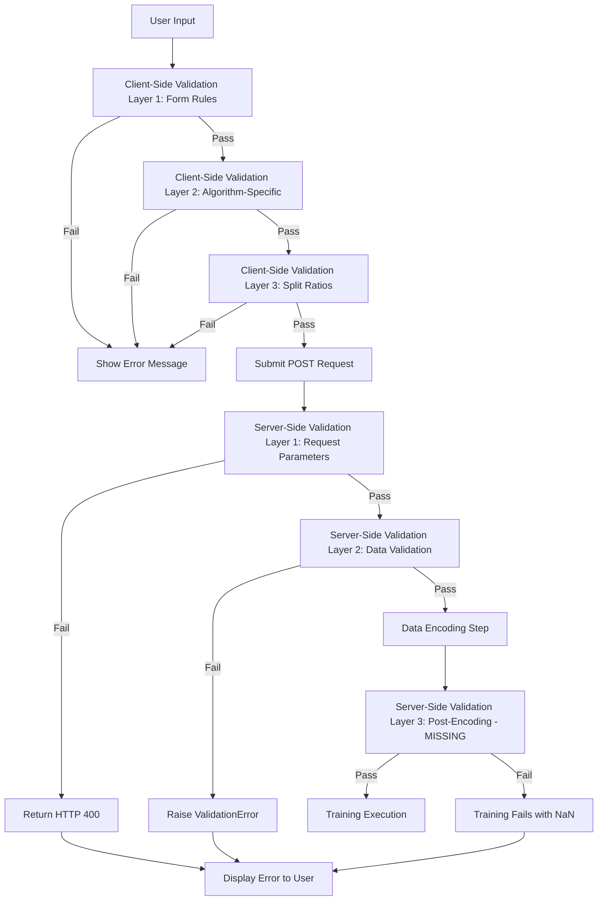
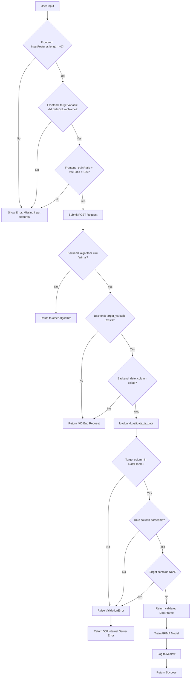
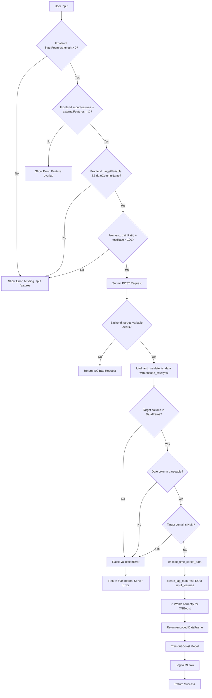
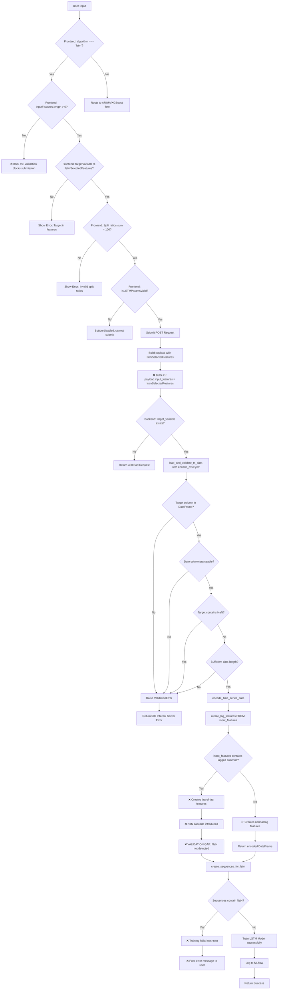

# Validation Logic Analysis - DREAM-ML Training Pipeline

**Date**: 2025-11-14
**Author**: Claude Code Research Agent
**Purpose**: Comprehensive documentation of all validation rules, error handling patterns, and data flow validation across frontend and backend

---

## Executive Summary

This document catalogs all validation logic in the DREAM-ML training pipeline, from frontend form validation to backend data validation. The analysis reveals inconsistencies between frontend and backend validation rules, identifies gaps where invalid data can slip through, and documents the complete validation data flow.

**Key Findings**:
1. **Frontend-Backend Mismatch**: Frontend validates `inputFeatures.length > 0` for all algorithms; backend doesn't enforce this for LSTM
2. **Post-Encoding Gap**: Backend validates data BEFORE encoding, misses NaN introduced by lag feature creation
3. **Algorithm-Specific Rules**: Each algorithm has different validation requirements not clearly documented
4. **Debounced Validation**: Split ratios validated with 500ms debounce, good UX but can cause submission attempts with stale state
5. **Error Message Localization**: All messages in Spanish, but inconsistent formatting/detail level

---

## Validation Architecture

### Validation Layers



---

## Frontend Validation Rules

All frontend validation is implemented in [TSTrainCard.jsx](DREAM-ML-frontend/frontend/src/components/TSTrainCard.jsx)

### Layer 1: Basic Form Validation

**Location**: [TSTrainCard.jsx:680-685](DREAM-ML-frontend/frontend/src/components/TSTrainCard.jsx#L680-L685)

**Function**: Inside `handleTrain()` before payload construction

```javascript
if (!inputFeatures.length || !targetVariable || !dateColumnName) {
  setTrainStatus("⚠️ Selecciona las variables de entrada, target y fecha.");
  return;
}
```

**Rules**:
| Field | Rule | Error Message |
|-------|------|---------------|
| `inputFeatures` | Must have length > 0 | "⚠️ Selecciona las variables de entrada, target y fecha." |
| `targetVariable` | Must be non-empty string | Same as above |
| `dateColumnName` | Must be non-empty string | Same as above |

**Bug Impact**:
- ❌ **Bug #2**: Checks `inputFeatures.length` for all algorithms
- LSTM uses `lstmSelectedFeatures` (separate state), `inputFeatures` remains empty
- LSTM univariate mode (empty `lstmSelectedFeatures`) blocked by this validation

**Algorithm Coverage**:
- ✅ ARIMA: Works (inputFeatures auto-populated)
- ✅ XGBoost: Works (inputFeatures auto-populated)
- ❌ LSTM: Broken (inputFeatures intentionally empty)

---

### Layer 2: Algorithm-Specific Validation

**Location**: [TSTrainCard.jsx:392-422](DREAM-ML-frontend/frontend/src/components/TSTrainCard.jsx#L392-L422)

**Function**: `validateSelections()`

```javascript
const validateSelections = () => {
  // XGBoost: Check for overlap between input and external features
  if (algorithm === "xgboost") {
    const overlap = inputFeatures.filter((feat) =>
      externalFeatures.includes(feat)
    );
    if (overlap.length > 0) {
      setTrainStatus(
        `⚠️ Las siguientes variables están en ambos: ${overlap.join(", ")}`
      );
      return false;
    }
  }

  // LSTM: Check target not in selected features
  if (algorithm === "lstm") {
    if (lstmSelectedFeatures.includes(targetVariable)) {
      setTrainStatus(
        "⚠️ La variable target no puede estar en las características seleccionadas."
      );
      return false;
    }
  }

  return true;
};
```

**XGBoost Rules**:
| Condition | Rule | Error Message |
|-----------|------|---------------|
| Feature overlap | `inputFeatures ∩ externalFeatures = ∅` | "⚠️ Las siguientes variables están en ambos: [overlapping features]" |

**LSTM Rules**:
| Condition | Rule | Error Message |
|-----------|------|---------------|
| Target in features | `targetVariable ∉ lstmSelectedFeatures` | "⚠️ La variable target no puede estar en las características seleccionadas." |

**ARIMA Rules**:
- None (ARIMA section has no specific validation in this function)

**Called From**:
- `handleTrain()` at line 680 (before submission)
- Potentially debounced on feature changes (depends on implementation)

---

### Layer 3: Split Ratio Validation

**Location**: [TSTrainCard.jsx:440-467](DREAM-ML-frontend/frontend/src/components/TSTrainCard.jsx#L440-L467)

**Function**: `validateSplitRatios()` (debounced)

```javascript
const validateSplitRatios = useCallback(
  debounce(() => {
    if (algorithm === "lstm") {
      // LSTM: 3-way split validation
      const sum = trainRatio + validationRatio + testRatio;
      if (sum !== 100) {
        setSplitRatiosValid(false);
        setTrainStatus(`⚠️ Los ratios deben sumar 100% (actual: ${sum}%)`);
      } else {
        setSplitRatiosValid(true);
        setTrainStatus("");
      }
    } else {
      // ARIMA/XGBoost: 2-way split validation
      const sum = trainRatio + testRatio;
      if (sum !== 100) {
        setSplitRatiosValid(false);
        setTrainStatus(`⚠️ Los ratios deben sumar 100% (actual: ${sum}%)`);
      } else {
        setSplitRatiosValid(true);
        setTrainStatus("");
      }
    }
  }, 500),  // 500ms debounce delay
  [algorithm, trainRatio, validationRatio, testRatio]
);
```

**ARIMA/XGBoost Rules**:
| Field | Rule | Error Message |
|-------|------|---------------|
| Split sum | `trainRatio + testRatio = 100` | "⚠️ Los ratios deben sumar 100% (actual: {sum}%)" |
| Train ratio | `trainRatio >= 0` | (Implicitly enforced by slider UI) |
| Test ratio | `testRatio >= 0` | (Implicitly enforced by slider UI) |

**LSTM Rules**:
| Field | Rule | Error Message |
|-------|------|---------------|
| Split sum | `trainRatio + validationRatio + testRatio = 100` | "⚠️ Los ratios deben sumar 100% (actual: {sum}%)" |
| Train ratio | `trainRatio >= 0` | (Implicitly enforced by slider UI) |
| Validation ratio | `validationRatio >= 0` | (Implicitly enforced by slider UI) |
| Test ratio | `testRatio >= 0` | (Implicitly enforced by slider UI) |

**Debounce Pattern**:
- User changes slider → 500ms timer starts
- If user changes again within 500ms → timer resets
- After 500ms of inactivity → validation executes
- Updates `splitRatiosValid` state → affects button disable logic

**Used In**:
- Button disable logic at [TSTrainCard.jsx:1094](DREAM-ML-frontend/frontend/src/components/TSTrainCard.jsx#L1094)

---

### Layer 4: LSTM Hyperparameter Validation

**Location**: [TSTrainCard.jsx:1023-1076](DREAM-ML-frontend/frontend/src/components/TSTrainCard.jsx#L1023-L1076)

**Function**: `isLSTMParamsValid()`

```javascript
const isLSTMParamsValid = () => {
  // Manual mode validation
  if (hyperparameterSearch === "manual") {
    if (
      !sequenceLength || sequenceLength <= 0 ||
      !lstmUnits || lstmUnits <= 0 ||
      dropoutRate < 0 || dropoutRate > 1 ||
      !batchSize || batchSize <= 0 ||
      !epochs || epochs <= 0
    ) {
      return false;
    }
  }

  // Grid search validation
  if (hyperparameterSearch === "grid") {
    if (
      !sequenceLengthRange.length ||
      !lstmUnitsRange.length ||
      !dropoutRateRange.length ||
      !batchSizeRange.length ||
      !epochsRange.length
    ) {
      return false;
    }
  }

  // Bayesian search validation
  if (hyperparameterSearch === "bayesian") {
    if (
      !numTrials || numTrials <= 0 ||
      sequenceLengthMin >= sequenceLengthMax ||
      lstmUnitsMin >= lstmUnitsMax ||
      dropoutRateMin >= dropoutRateMax ||
      batchSizeMin >= batchSizeMax ||
      epochsMin >= epochsMax
    ) {
      return false;
    }
  }

  return true;
};
```

**Manual Mode Rules**:
| Parameter | Rule | Error Indication |
|-----------|------|------------------|
| `sequenceLength` | > 0 | Button disabled |
| `lstmUnits` | > 0 | Button disabled |
| `dropoutRate` | 0 ≤ x ≤ 1 | Button disabled |
| `batchSize` | > 0 | Button disabled |
| `epochs` | > 0 | Button disabled |

**Grid Search Mode Rules**:
| Parameter | Rule | Error Indication |
|-----------|------|------------------|
| `sequenceLengthRange` | Array length > 0 | Button disabled |
| `lstmUnitsRange` | Array length > 0 | Button disabled |
| `dropoutRateRange` | Array length > 0 | Button disabled |
| `batchSizeRange` | Array length > 0 | Button disabled |
| `epochsRange` | Array length > 0 | Button disabled |

**Bayesian Search Mode Rules**:
| Parameter | Rule | Error Indication |
|-----------|------|------------------|
| `numTrials` | > 0 | Button disabled |
| `sequenceLengthMin` | < `sequenceLengthMax` | Button disabled |
| `lstmUnitsMin` | < `lstmUnitsMax` | Button disabled |
| `dropoutRateMin` | < `dropoutRateMax` | Button disabled |
| `batchSizeMin` | < `batchSizeMax` | Button disabled |
| `epochsMin` | < `epochsMax` | Button disabled |

**Error Messaging**:
- ❌ **Gap**: No explicit error messages, only button disable
- User doesn't know which parameter is invalid

**Used In**:
- Button disable logic at [TSTrainCard.jsx:1094](DREAM-ML-frontend/frontend/src/components/TSTrainCard.jsx#L1094)

---

### Button Disable Logic (Combined Validation)

**Location**: [TSTrainCard.jsx:1094-1105](DREAM-ML-frontend/frontend/src/components/TSTrainCard.jsx#L1094-L1105)

```javascript
const isDisabled =
  (algorithm !== "lstm" && !inputFeatures.length) ||  // ← Bug #3 partial fix
  !targetVariable ||
  !dateColumnName ||
  !modelName ||
  !splitRatiosValid ||
  isTraining ||
  (algorithm === "lstm" && !isLSTMParamsValid());
```

**Disable Conditions**:
1. ARIMA/XGBoost: `inputFeatures` empty
2. All algorithms: Missing target variable
3. All algorithms: Missing date column
4. All algorithms: Missing model name
5. All algorithms: Invalid split ratios (`splitRatiosValid === false`)
6. All algorithms: Training in progress (`isTraining === true`)
7. LSTM only: Invalid LSTM hyperparameters (`!isLSTMParamsValid()`)

**LSTM Exemption**:
- Line `(algorithm !== "lstm" && !inputFeatures.length)` exempts LSTM from `inputFeatures` check
- **Bug #3**: Partial fix that enables button but doesn't fix validation at line 681

---

## Backend Validation Rules

All backend validation is implemented in Django views and training functions.

### Layer 1: Request Parameter Validation

**Location**: [views.py:376](DREAM-ML-backend/GEML/apiTimeSeries/views.py#L376)

**Function**: `train_model()` view

```python
# Approximate implementation (simplified)
def train_model(request):
    # Check HTTP method
    if request.method != "POST":
        return JsonResponse({"error": "Method not allowed"}, status=405)

    # Extract required parameters
    algorithm = request.POST.get('algorithm')
    if not algorithm or algorithm not in ['arima', 'xgboost', 'lstm']:
        return JsonResponse({"error": "Invalid algorithm"}, status=400)

    target_variable = request.POST.get('target_variable')
    if not target_variable:
        return JsonResponse({"error": "Missing target_variable"}, status=400)

    date_column_name = request.POST.get('date_column_name')
    if not date_column_name:
        return JsonResponse({"error": "Missing date_column_name"}, status=400)

    dataset_id = request.POST.get('dataset')
    if not dataset_id:
        return JsonResponse({"error": "Missing dataset ID"}, status=400)

    # Validate dataset exists
    try:
        dataset = Dataset.objects.get(id=dataset_id)
    except Dataset.DoesNotExist:
        return JsonResponse({"error": "Dataset not found"}, status=404)

    # Extract optional parameters
    input_features = request.POST.getlist('input_features')  # Can be empty for LSTM
    external_features = request.POST.getlist('external_features', [])

    # Delegate to service layer
    # ... (no further validation at this layer)
```

**Validation Rules**:
| Parameter | Rule | HTTP Response |
|-----------|------|---------------|
| HTTP method | Must be POST | 405 Method Not Allowed |
| `algorithm` | Must be in ['arima', 'xgboost', 'lstm'] | 400 Bad Request |
| `target_variable` | Must be non-empty | 400 Bad Request |
| `date_column_name` | Must be non-empty | 400 Bad Request |
| `dataset` (ID) | Must exist in database | 404 Not Found |
| `input_features` | Optional (can be empty list) | No error |
| `external_features` | Optional (can be empty list) | No error |

**Gap Identified**:
- ❌ No validation that `input_features` is non-empty for ARIMA/XGBoost
- Frontend enforces this, but backend doesn't
- Could accept invalid requests if frontend bypassed

---

### Layer 2: Data Validation

**Location**: [train.py:88](DREAM-ML-backend/GEML/apiTimeSeries/train.py#L88)

**Function**: `load_and_validate_ts_data()`

```python
def load_and_validate_ts_data(
    dataset,
    target_variable,
    date_column_name,
    input_features=None,
    encode_csv='no',
    lag_periods=0,
    rolling_window_periods=0,
    ...
):
    """
    Load CSV, validate columns and data quality, optionally encode features.

    Raises:
        ValidationError: If data validation fails
    """
    # 1. Load CSV file
    csv_path = dataset.csv_file.path
    if not os.path.exists(csv_path):
        raise ValidationError(f"CSV file not found: {csv_path}")

    df = pd.read_csv(csv_path)

    # 2. Validate target variable exists
    if target_variable not in df.columns:
        raise ValidationError(f"Target variable '{target_variable}' not found in dataset columns: {list(df.columns)}")

    # 3. Validate date column exists
    if date_column_name not in df.columns:
        raise ValidationError(f"Date column '{date_column_name}' not found in dataset columns: {list(df.columns)}")

    # 4. Parse date column
    try:
        df[date_column_name] = pd.to_datetime(df[date_column_name])
    except Exception as e:
        raise ValidationError(f"Failed to parse date column '{date_column_name}': {str(e)}")

    # 5. Sort by date
    df = df.sort_values(by=date_column_name)

    # 6. Check for missing values in target
    if df[target_variable].isnull().any():
        num_missing = df[target_variable].isnull().sum()
        raise ValidationError(f"Target variable contains {num_missing} missing values. Please clean the data first.")

    # 7. Validate minimum data length (for LSTM)
    if algorithm == "lstm" and len(df) < sequence_length + forecast_horizon:
        raise ValidationError(
            f"Insufficient data for LSTM training. Need at least {sequence_length + forecast_horizon} rows, got {len(df)}."
        )

    # 8. Optional: Encode CSV (create lag features, rolling windows, etc.)
    if encode_csv == 'yes':
        df_encoded = encode_time_series_data(
            df=df,
            input_features=input_features,
            lag_periods=lag_periods,
            rolling_window_periods=rolling_window_periods,
            date_column=date_column_name,
            ...
        )
        # ❌ VALIDATION GAP: No check for NaN after encoding
        return df_encoded
    else:
        return df
```

**Validation Rules**:
| Check | Rule | Exception Raised |
|-------|------|------------------|
| CSV existence | File must exist at `dataset.csv_file.path` | `ValidationError` |
| Target column | Must exist in DataFrame columns | `ValidationError` |
| Date column | Must exist in DataFrame columns | `ValidationError` |
| Date parsing | Date column must be parseable to datetime | `ValidationError` |
| Target NaN (pre-encoding) | Target variable must not contain NaN | `ValidationError` |
| Data length (LSTM) | `len(df) >= sequence_length + forecast_horizon` | `ValidationError` |

**Critical Gap**:
- ✅ Validates NaN in target **before** encoding
- ❌ Does NOT validate NaN **after** encoding
- **Bug Impact**: Lag-of-lag features create NaN during encoding, not caught

---

### Layer 3: Post-Encoding Validation (MISSING)

**Expected Location**: After [data_encoding_utils.py:139](DREAM-ML-backend/GEML/apiTimeSeries/data_encoding_utils.py#L139) `encode_time_series_data()` returns

**Current Behavior**:
```python
# train.py:2188 (LSTM training, simplified)
df_encoded = load_and_validate_ts_data(
    dataset=dataset,
    encode_csv='yes',
    lag_periods=lag_periods,
    ...
)
# ❌ No validation here for NaN in df_encoded

# Proceed directly to sequence creation
X, y = create_sequences_for_lstm(df_encoded, target_col, sequence_length, input_features)
# ❌ No validation here for NaN in X or y

# Train model
model.fit(X, y, ...)
# Training fails with loss=nan
```

**Missing Validation**:
1. Check `df_encoded` for NaN in any column
2. Check sequence arrays `X`, `y` for NaN
3. Raise `ValidationError` with clear message about which columns contain NaN

**Proposed Validation**:
```python
# After encoding
if df_encoded.isnull().any().any():
    nan_columns = df_encoded.columns[df_encoded.isnull().any()].tolist()
    raise ValidationError(
        f"Data encoding introduced NaN values in columns: {nan_columns}. "
        f"This may be caused by lag feature creation from already-lagged features."
    )

# After sequence creation
if np.isnan(X).any() or np.isnan(y).any():
    raise ValidationError(
        "Sequences contain NaN values. Cannot train LSTM model. "
        "Check input features for invalid values or excessive lag periods."
    )
```

---

## Validation Data Flow

### ARIMA Validation Flow



---

### XGBoost Validation Flow



---

### LSTM Validation Flow (Current - With Bugs)



---

## Validation Rule Comparison Table

### Frontend vs Backend Rules

| Validation Check | Frontend Rule | Backend Rule | Consistency |
|------------------|---------------|--------------|-------------|
| **Target variable required** | ✅ Non-empty string | ✅ Non-empty, exists in DataFrame | ✅ Consistent |
| **Date column required** | ✅ Non-empty string | ✅ Non-empty, exists in DataFrame, parseable | ✅ Consistent |
| **Input features required (ARIMA/XGBoost)** | ✅ Array length > 0 | ❌ Not validated | ⚠️ Frontend stricter |
| **Input features required (LSTM)** | ❌ Incorrectly required | ❌ Not validated | ❌ Both wrong |
| **Target contains NaN** | ❌ Not checked | ✅ Validated before encoding | ⚠️ Backend stricter |
| **Target contains NaN (post-encoding)** | ❌ Not checked | ❌ Not checked | ❌ Gap in both |
| **Split ratios sum = 100** | ✅ Debounced validation | ❌ Not validated | ⚠️ Frontend stricter |
| **Feature overlap (XGBoost)** | ✅ No overlap | ❌ Not validated | ⚠️ Frontend stricter |
| **Target in features (LSTM)** | ✅ Target not in lstmSelectedFeatures | ❌ Not validated | ⚠️ Frontend stricter |
| **LSTM params valid** | ✅ Range checks | ❌ Not validated (may fail during training) | ⚠️ Frontend stricter |
| **Data length sufficient (LSTM)** | ❌ Not checked | ✅ `len >= seq_len + horizon` | ⚠️ Backend stricter |

---

## Algorithm-Specific Validation Matrix

### ARIMA

| Validation Rule | Frontend | Backend | Gap |
|-----------------|----------|---------|-----|
| `inputFeatures.length > 0` | ✅ Required | ❌ Not checked | Backend should validate |
| `targetVariable` exists | ✅ Required | ✅ Required | None |
| `dateColumnName` exists | ✅ Required | ✅ Required | None |
| `trainRatio + testRatio = 100` | ✅ Required | ❌ Not checked | Backend should validate |
| Target contains NaN | ❌ Not checked | ✅ Checked | Frontend could pre-validate |
| `p, d, q` orders valid | ❌ Not validated | ❌ May fail during fit | Both should validate |

---

### XGBoost

| Validation Rule | Frontend | Backend | Gap |
|-----------------|----------|---------|-----|
| `inputFeatures.length > 0` | ✅ Required | ❌ Not checked | Backend should validate |
| `inputFeatures ∩ externalFeatures = ∅` | ✅ Required | ❌ Not checked | Backend should validate |
| `targetVariable` exists | ✅ Required | ✅ Required | None |
| `dateColumnName` exists | ✅ Required | ✅ Required | None |
| `trainRatio + testRatio = 100` | ✅ Required | ❌ Not checked | Backend should validate |
| `lagPeriods > 0` | ❌ Not validated | ❌ Could be 0 (invalid) | Both should validate |
| Target contains NaN | ❌ Not checked | ✅ Checked (pre-encoding) | Frontend could pre-validate |
| Features contain NaN (post-encoding) | ❌ Not checked | ❌ Not checked | **Critical gap** |

---

### LSTM

| Validation Rule | Frontend | Backend | Gap |
|-----------------|----------|---------|-----|
| `lstmSelectedFeatures` (not `inputFeatures`) | ❌ Checks wrong variable | ❌ Not checked | **Bug #2: Frontend broken** |
| `targetVariable ∉ lstmSelectedFeatures` | ✅ Required | ❌ Not checked | Backend should validate |
| `targetVariable` exists | ✅ Required | ✅ Required | None |
| `dateColumnName` exists | ✅ Required | ✅ Required | None |
| `trainRatio + validationRatio + testRatio = 100` | ✅ Required | ❌ Not checked | Backend should validate |
| `sequenceLength > 0` | ✅ Required | ❌ Not checked | Backend should validate |
| `lstmUnits > 0` | ✅ Required | ❌ Not checked | Backend should validate |
| `0 ≤ dropoutRate ≤ 1` | ✅ Required | ❌ Not checked | Backend should validate |
| `batchSize > 0` | ✅ Required | ❌ Not checked | Backend should validate |
| `epochs > 0` | ✅ Required | ❌ Not checked | Backend should validate |
| `len(df) >= sequenceLength + forecastHorizon` | ❌ Not checked | ✅ Checked | Frontend could pre-validate |
| Target contains NaN | ❌ Not checked | ✅ Checked (pre-encoding) | Frontend could pre-validate |
| Features contain NaN (post-encoding) | ❌ Not checked | ❌ Not checked | **Critical gap (causes Bug #1)** |
| Sequences contain NaN | ❌ Not checked | ❌ Not checked | **Critical gap** |

---

## Error Message Catalog

### Frontend Error Messages

All messages in Spanish:

| Error Message | Condition | Location |
|---------------|-----------|----------|
| "⚠️ Selecciona las variables de entrada, target y fecha." | Missing inputFeatures, target, or date | [TSTrainCard.jsx:682](DREAM-ML-frontend/frontend/src/components/TSTrainCard.jsx#L682) |
| "⚠️ Las siguientes variables están en ambos: {overlap}" | XGBoost feature overlap | [TSTrainCard.jsx:400](DREAM-ML-frontend/frontend/src/components/TSTrainCard.jsx#L400) |
| "⚠️ La variable target no puede estar en las características seleccionadas." | LSTM target in features | [TSTrainCard.jsx:413](DREAM-ML-frontend/frontend/src/components/TSTrainCard.jsx#L413) |
| "⚠️ Los ratios deben sumar 100% (actual: {sum}%)" | Invalid split ratios | [TSTrainCard.jsx:448](DREAM-ML-frontend/frontend/src/components/TSTrainCard.jsx#L448) |
| (No message, button disabled) | Invalid LSTM parameters | [TSTrainCard.jsx:1094](DREAM-ML-frontend/frontend/src/components/TSTrainCard.jsx#L1094) |

**Error Message Issues**:
1. ❌ Generic message doesn't specify which field is missing
2. ❌ LSTM parameter validation has no error message
3. ❌ No distinction between "field empty" vs "field invalid"
4. ❌ Spanish-only (no internationalization)

---

### Backend Error Messages

Mix of ValidationError and HTTP responses:

| Error Message | Condition | Location |
|---------------|-----------|----------|
| "Method not allowed" | Non-POST request | [views.py:376](DREAM-ML-backend/GEML/apiTimeSeries/views.py#L376) |
| "Invalid algorithm" | Algorithm not in allowed list | [views.py:376](DREAM-ML-backend/GEML/apiTimeSeries/views.py#L376) |
| "Missing target_variable" | Empty target parameter | [views.py:376](DREAM-ML-backend/GEML/apiTimeSeries/views.py#L376) |
| "Missing date_column_name" | Empty date parameter | [views.py:376](DREAM-ML-backend/GEML/apiTimeSeries/views.py#L376) |
| "Dataset not found" | Invalid dataset ID | [views.py:376](DREAM-ML-backend/GEML/apiTimeSeries/views.py#L376) |
| "CSV file not found: {path}" | Missing CSV file | [train.py:88](DREAM-ML-backend/GEML/apiTimeSeries/train.py#L88) |
| "Target variable '{var}' not found in dataset columns: {cols}" | Column missing | [train.py:88](DREAM-ML-backend/GEML/apiTimeSeries/train.py#L88) |
| "Date column '{col}' not found in dataset columns: {cols}" | Column missing | [train.py:88](DREAM-ML-backend/GEML/apiTimeSeries/train.py#L88) |
| "Failed to parse date column '{col}': {error}" | Date parsing failed | [train.py:88](DREAM-ML-backend/GEML/apiTimeSeries/train.py#L88) |
| "Target variable contains {num} missing values. Please clean the data first." | NaN in target | [train.py:88](DREAM-ML-backend/GEML/apiTimeSeries/train.py#L88) |
| "Insufficient data for LSTM training. Need at least {min} rows, got {actual}." | Too few rows | [train.py:88](DREAM-ML-backend/GEML/apiTimeSeries/train.py#L88) |
| (No error, training fails silently) | NaN after encoding | ❌ Missing validation |
| (No error, training fails with loss=nan) | NaN in sequences | ❌ Missing validation |

**Error Message Issues**:
1. ✅ Backend messages are more specific and informative
2. ❌ No validation for post-encoding NaN (critical gap)
3. ❌ Training failures produce cryptic error logs, not user-friendly messages

---

## Validation Gaps Summary

### Critical Gaps (High Priority)

1. **Post-Encoding NaN Validation** (Causes Bug #1)
   - **Location**: After [data_encoding_utils.py:139](DREAM-ML-backend/GEML/apiTimeSeries/data_encoding_utils.py#L139)
   - **Impact**: Lag-of-lag features create NaN → LSTM training fails
   - **Fix**: Add validation check after encoding step

2. **Frontend LSTM Feature Validation** (Causes Bug #2)
   - **Location**: [TSTrainCard.jsx:681](DREAM-ML-frontend/frontend/src/components/TSTrainCard.jsx#L681)
   - **Impact**: LSTM univariate mode blocked
   - **Fix**: Check `lstmSelectedFeatures` instead of `inputFeatures` for LSTM

3. **Sequence NaN Validation** (Defense-in-depth)
   - **Location**: After `create_sequences_for_lstm()` in [train.py:1671](DREAM-ML-backend/GEML/apiTimeSeries/train.py#L1671)
   - **Impact**: NaN sequences cause training to fail with cryptic error
   - **Fix**: Add `np.isnan()` check on X, y arrays

---

### Medium Priority Gaps

4. **Backend Input Features Validation** (ARIMA/XGBoost)
   - **Location**: [views.py:376](DREAM-ML-backend/GEML/apiTimeSeries/views.py#L376) or [services.py:943](DREAM-ML-backend/GEML/apiTimeSeries/services.py#L943)
   - **Impact**: Could accept empty `input_features` if frontend bypassed
   - **Fix**: Add check `if algorithm in ['arima', 'xgboost'] and not input_features: raise ValidationError`

5. **Backend Split Ratio Validation**
   - **Location**: [services.py:943](DREAM-ML-backend/GEML/apiTimeSeries/services.py#L943)
   - **Impact**: Invalid split ratios may cause training errors
   - **Fix**: Validate sum equals 100 and all values >= 0

6. **Backend Feature Overlap Validation** (XGBoost)
   - **Location**: [train.py:1240](DREAM-ML-backend/GEML/apiTimeSeries/train.py#L1240) `train_xgboost_model()`
   - **Impact**: Duplicate features in input and external lists
   - **Fix**: Check `set(input_features) ∩ set(external_features) = ∅`

7. **Backend LSTM Hyperparameter Validation**
   - **Location**: [train.py:2188](DREAM-ML-backend/GEML/apiTimeSeries/train.py#L2188) `train_lstm_model()`
   - **Impact**: Invalid hyperparameters may cause Keras errors
   - **Fix**: Validate ranges before model construction

---

### Low Priority Gaps (UX Improvements)

8. **Frontend Error Message Specificity**
   - **Location**: All frontend validation functions
   - **Impact**: Users don't know exactly what's wrong
   - **Fix**: Separate error messages per field

9. **LSTM Parameter Validation Error Messages**
   - **Location**: [TSTrainCard.jsx:1023](DREAM-ML-frontend/frontend/src/components/TSTrainCard.jsx#L1023)
   - **Impact**: Button disabled with no explanation
   - **Fix**: Display which parameter is invalid

10. **Frontend Data Length Validation** (LSTM)
    - **Location**: Before submission in `handleTrain()`
    - **Impact**: User discovers insufficient data only after backend validation
    - **Fix**: Fetch dataset row count, validate `rows >= sequenceLength + forecastHorizon`

---

## Open Questions

### 1. Should Backend Mirror All Frontend Validations?

**Question**: Should the backend re-validate all rules enforced by frontend (defense-in-depth)?

**Current State**:
- Frontend: Validates split ratios, feature overlap, LSTM params
- Backend: Does NOT re-validate these

**Options**:
1. **Defense-in-depth**: Backend validates everything (protects against bypassing frontend)
2. **Trust frontend**: Backend only validates data integrity (current approach)
3. **Hybrid**: Backend validates critical rules only (data quality, security)

---

### 2. What Should Happen When Post-Encoding NaN Detected?

**Question**: Should the system reject the request, auto-clean the data, or warn the user?

**Options**:
1. **Reject**: Raise ValidationError, inform user which columns have NaN
2. **Auto-clean**: Drop NaN rows, log warning, continue training
3. **Warn and ask**: Return warning to frontend, ask user to confirm or fix

**Implications**:
- Rejecting prevents bad training runs but requires user to fix data
- Auto-cleaning may silently drop important data
- Warning requires frontend UI changes

---

### 3. Should LSTM Support Already-Lagged Features?

**Question**: Is it valid for LSTM to receive pre-lagged features like "Temperature_lag_1"?

**Context**:
- Current Phase 4 UI allows selecting any column, including lagged ones
- Backend creates lags FROM input_features (causes lag-of-lag bug)

**Options**:
1. **Disallow**: Filter out lagged features in frontend (validation or UI)
2. **Allow with flag**: Send flag to backend to skip lag creation for LSTM
3. **Detect and skip**: Backend detects lagged features, skips creating more lags
4. **Clarify intent**: Rename `input_features` to `raw_features` to make intent clear

---

### 4. Error Message Localization Strategy?

**Question**: Should error messages be internationalized (i18n)?

**Current State**:
- Frontend: Spanish only
- Backend: English only

**Options**:
1. **Add i18n**: Use React i18n library, translate all messages
2. **Standardize on English**: Change frontend to English
3. **Keep mixed**: Spanish frontend, English backend (current)

---

## Summary of Findings

### Validation Strengths

1. **Frontend Proactive Validation**: Good UX, catches errors before submission
2. **Debounced Split Ratio Validation**: Smooth UX, avoids excessive error messages
3. **Backend Data Integrity Validation**: Catches CSV issues, column mismatches
4. **LSTM Parameter Validation**: Prevents invalid hyperparameters from reaching backend

### Validation Weaknesses

1. **Post-Encoding Gap**: Critical bug (NaN not detected after lag feature creation)
2. **LSTM Frontend Bug**: Checks wrong state variable (`inputFeatures` vs `lstmSelectedFeatures`)
3. **Frontend-Backend Inconsistency**: Frontend stricter than backend in many cases
4. **Poor Error Messages**: Generic, not specific to field or issue
5. **No Sequence Validation**: NaN in LSTM sequences not detected before training

### Recommended Validation Improvements

**High Priority**:
1. Add post-encoding NaN validation in backend
2. Fix LSTM frontend validation to check `lstmSelectedFeatures`
3. Add sequence NaN validation before LSTM training

**Medium Priority**:
4. Backend should validate `input_features` non-empty for ARIMA/XGBoost
5. Backend should validate split ratios sum to 100
6. Improve error message specificity in frontend

**Low Priority**:
7. Add internationalization (i18n) for error messages
8. Frontend pre-validation for data length (LSTM)
9. Standardize validation error response format (JSON structure)

---

**Document Status**: ✅ Complete
**Review Date**: 2025-11-14
**Related Documents**:
- [Backend Analysis](2025-11-14_backend-analysis.md)
- [Frontend Analysis](2025-11-14_frontend-analysis.md)
- [Recommendations](2025-11-14_recommendations.md) (pending)
